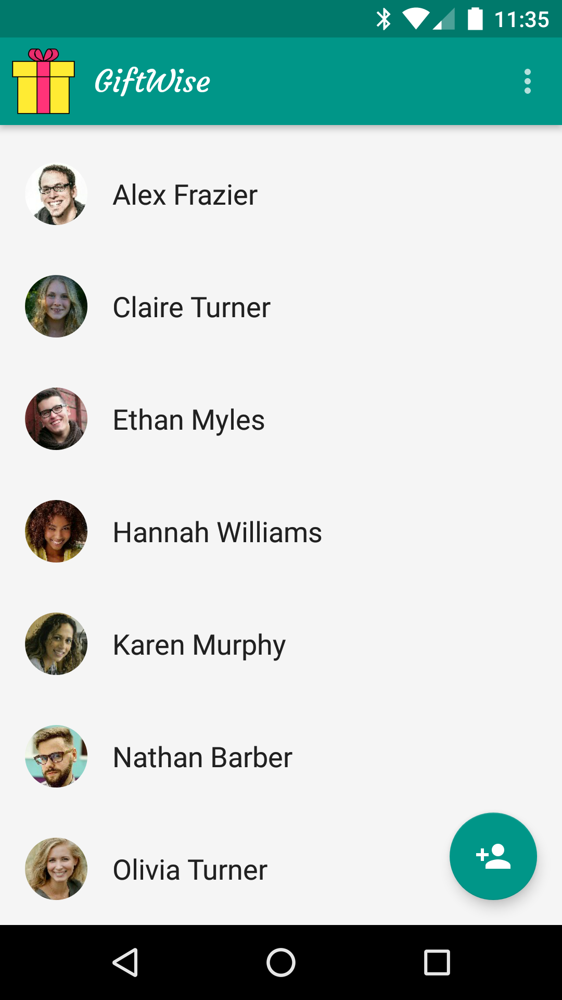
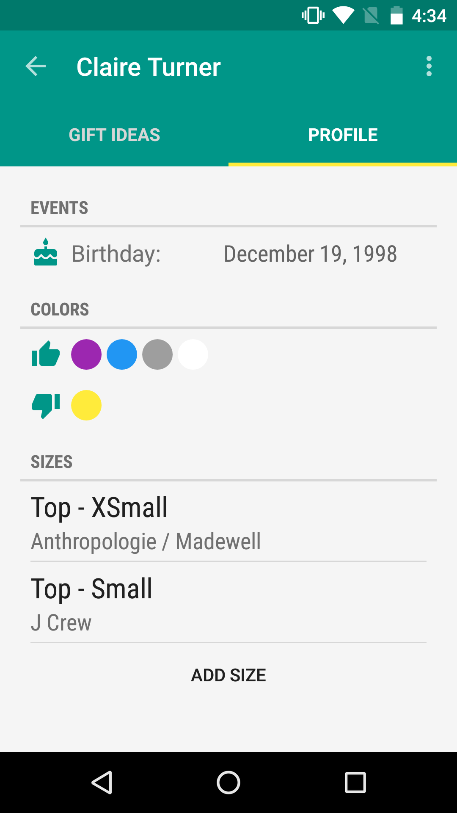
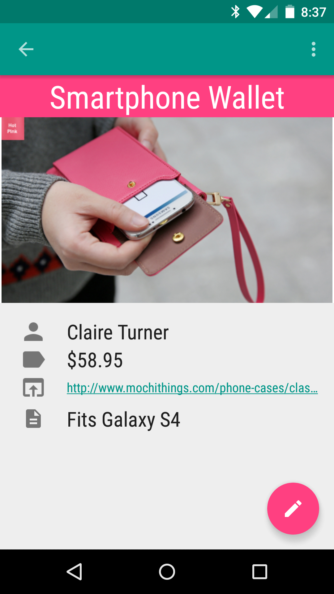

GiftWise
========
GiftWise is an app for organizing gift ideas. It simplifies storing gift details and personal information about your family and friends.

With GiftWise you can:

- import family and friends from your Contacts
- create lists of gift ideas
- add personal information including sizes and colors
- see special events such as birthdays at a glance
- add a gift idea by sharing a URL from your browser
- share your GiftWise ideas by email or social media

### About
GiftWise was conceived as a final project developed for the Udacity course [Developing Android Apps: Android Fundamentals](https://www.udacity.com/course/ud853), 
It won [first place](https://plus.google.com/105162452149208177718/posts/SpC8D9R7V2w) in the [GDG Triangle](https://plus.google.com/u/0/105162452149208177718/posts) 2015 Android Study Jam.

### Download
An APK can be downloaded [here] (https://drive.google.com/file/d/0BzY8dMKto_MqZ3M4VUJ2VFJaV3M/view?usp=sharing). GiftWise will be available on Google Play soon.

### Acknowledgments
* The [FloatingActionButton](https://github.com/makovkastar/FloatingActionButton) library by [Melnykov Oleksandr](https://github.com/makovkastar) was used
* The [SlidingTabLayout](https://github.com/google/iosched/blob/master/android/src/main/java/com/google/samples/apps/iosched/ui/widget/SlidingTabLayout.java) and [SlidingTabStrip](https://github.com/google/iosched/blob/master/android/src/main/java/com/google/samples/apps/iosched/ui/widget/SlidingTabStrip.java) from the The Google I/O 2014 Android App [ioshed] (https://github.com/google/iosched) app were used
* The [Android ColorPicker](https://android.googlesource.com/platform/frameworks/opt/colorpicker) was used
* The GiftWise launch icon was created with Blender by [Dino Morelli](https://github.com/dino-)
